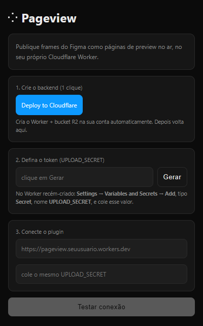
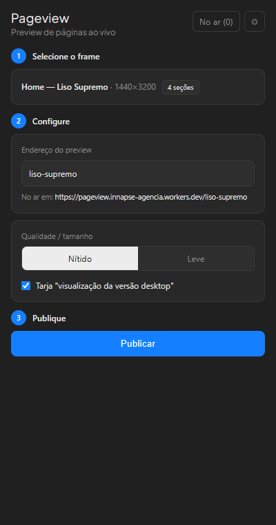

# Pageview

**Publique qualquer página do Figma como um link no ar, em segundos.**

Você seleciona o frame de uma página, clica em **Publicar**, e o Pageview gera
um link público (tipo `seu-worker.workers.dev/home`) pra você mandar pro cliente
— sem exportar imagem na mão, sem subir arquivo em lugar nenhum, sem servidor
pra manter. Republicar no mesmo endereço atualiza o preview sozinho.

O plugin te guia em 3 passos: **conectar → selecionar o frame → publicar.**

  
  &nbsp;&nbsp;
  

  

## Limites do plano grátis da Cloudflare

Tudo roda no plano **gratuito** da Cloudflare. Na prática, um uso normal nunca
chega perto dos limites — pra dar uma noção com comparações:

- **Visitas:** ~100 mil requisições por dia. Como cada abertura de um preview
  carrega a página + algumas imagens, isso dá **milhares de aberturas por dia**.
  O link de um cliente jamais encosta nesse teto.
- **Armazenamento:** 10 GB. Cada preview pesa poucos MB (menos ainda no modo
  "Leve"), então **cabem centenas a milhares de páginas publicadas** ao mesmo
  tempo — pense num arquivo gigante de projetos, não numa gaveta pequena.
- **Banda (download):** grátis e ilimitada. Aquilo que normalmente encarece uma
  hospedagem — as pessoas baixando as imagens — aqui **não custa nada**. Pode
  espalhar os links à vontade.
- **Sem custo por publicação:** publique e republique quantas vezes quiser.

Se um dia isso estourar, é porque seus previews viraram um site movimentado — e
aí a Cloudflare tem planos pagos que continuam baratos.

## Licença

MIT — veja [LICENSE](LICENSE).
